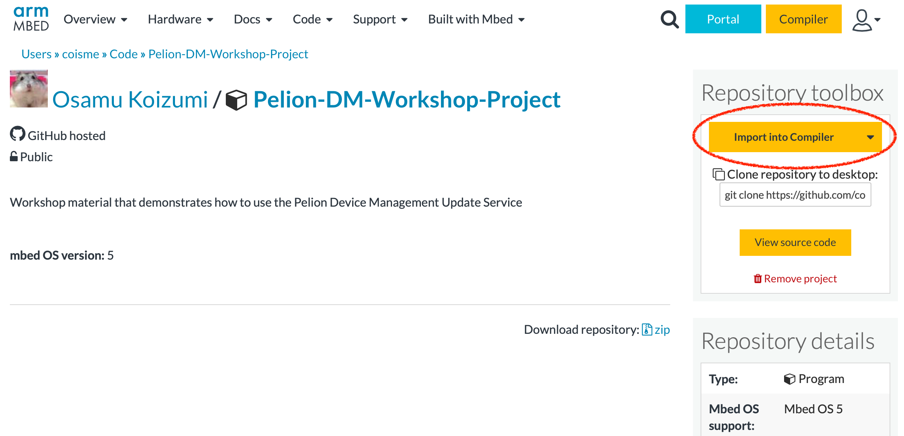
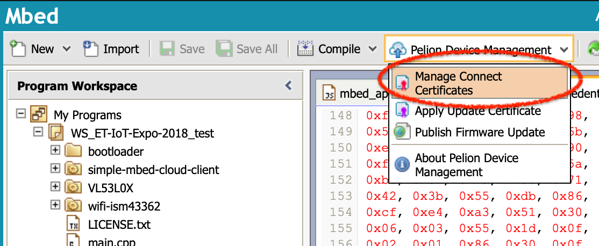
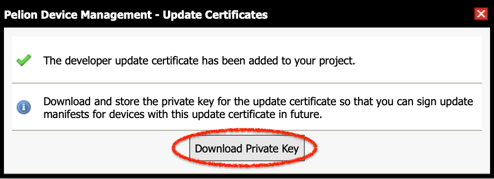
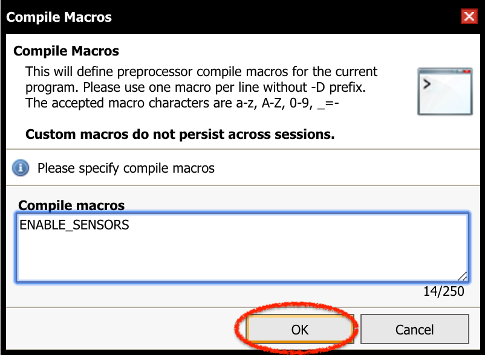
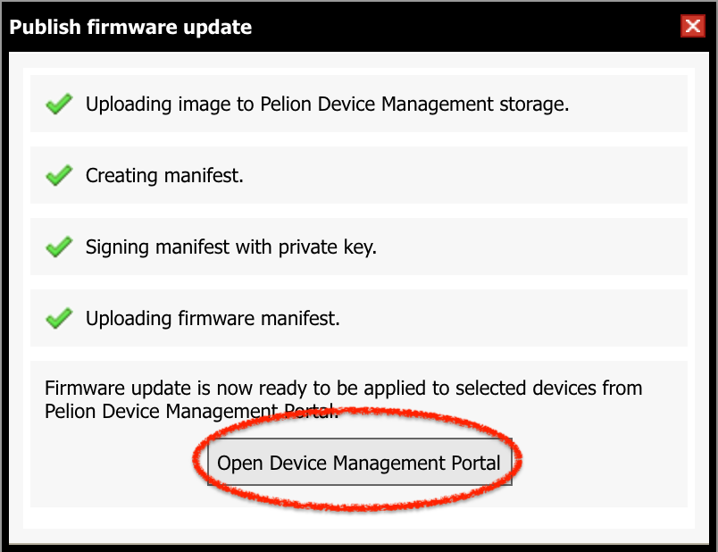

本ワークショップでは [B-L475E-IOT01A Discovery](https://os.mbed.com/platforms/ST-Discovery-L475E-IOT01A/) ボードを用いて IoT デバイスを作成し、次のことを体験できます。

1. Mbed オンラインコンパイラを利用して IoT デバイスのファームウェアを作成する
1. Pelion Device Management で IoT デバイスを管理する
1. IoT デバイスのファームウェアを OTA (Over-The-Air) で更新する
1. (Pelion Device Management と連携する WEB アプリを作成する)


# 事前準備

## ターミナルソフトウェアのインストール

本ワークショップではターミナルソフトを使用して IoT デバイスからのメッセージをモニタします。[Teraterm](https://ja.osdn.net/projects/ttssh2/) (Windows)、 [Coolterm](http://freeware.the-meiers.org) (Windows/macOS/Linux) などのターミナルソフトをインストールしてください。


## Mbed アカウントを作成する

本ワークショップでは Mbed オンラインコンパイラを使用します。アカウントをお持ちでない方は、事前に以下のサインアップページから登録を済ませておいてください。

https://os.mbed.com/account/signup/


## Pelion Device Management のフリートライアルを登録する

本ワークショップでは Pelion Device Management を使用します。 Pelion Device Management のフリートライアルを以下のページから申請してください。申請には上で作成した Mbed アカウントでのログインが必要です。

https://console.mbed.com/cloud-registration

必須項目を入力して *Submit* すると、 Pelion Device Management Portal へと画面が遷移します。途中でログイン画面になりますので、*Log in with Mbed.com* ボタンをクリックしてください。

||
|:-:|

さらに画面が遷移し、Pelion Portal のコンソール画面がでてきますが、ここでライセンス条項への同意が必要になります。

||
|:-:|

同意する場合は *I accept this license on behalf of my team* にチェックを入れて、*Accept* ボタンをクリックしてください。

完了したら Device Management Portal のウィンドウは閉じて構いません。

# ファームウェアを作成する

Pelion Device Management と連携するために必要な Pelion Device Management Client を含むファームウェアを作成し、IoT デバイスに適用します。


## プラットフォームを追加する

開発ボード（プラットフォーム）として今回使用する B-L475E-IOT01A Discovery kit for IoT node をアカウントに追加します。次のいずれかの方法で登録してください。

### 手元のボードを使って登録

Mbed.com にログインした状態で以下の作業を行います。

1. パソコンと手元のボードを USB ケーブルで接続してください。ボードが USB ドライブとして認識されます。 
1. USB ドライブの中にある `MBED.HTM` をブラウザで開いてください。自動的にボードがアカウントに追加されます。

### サイトにアクセスして登録

次のページを開いてください。

https://os.mbed.com/platforms/ST-Discovery-L475E-IOT01A/

画面右にある **Add to your Mbed Compiler** をクリックしてください。

||
|:-:|

クリックすると追加処理が行われ、完了すると *Platform 'DISCO-L475VG-IOT01A' is now added to your account!* と表示されます。


## プロジェクトをインポートする

オンラインコンパイラのワークスペースにプロジェクトをインポートします。Mbed サイトのログインした状態で、次のページの右にある黄色いボタン *Import into Compiler* をクリックしてください。

https://os.mbed.com/users/coisme/code/WS_ET-IoT-Expo-2018/



*Import into Compiler* ボタンをクリックするとオンラインコンパイラに画面が遷移します。インポートを確認するダイアログがでてくるので、*Import* ボタンをクリックしてインポートします。この際、 *Update all libraries to the latest revision* は **チェックしないでください** 。


## Wi-Fi アクセスポイントの情報を設定する

IoT デバイスが接続する Wi-Fi  アクセスポイントの情報を設定します。プロジェクトのルートにあるファイル `mbed_app.json` を開き、`target_overrides` の中にある次の項目を編集してください。

```
            "nsapi.default-wifi-security"       : "WPA_WPA2",
            "nsapi.default-wifi-ssid"           : "\"SSID\"",
            "nsapi.default-wifi-password"       : "\"Password\""
```

`nsapi.default-wifi-security` には `WEP` 、 `WPA` 、 `WPA2` 、 `WPA_WPA2` が設定できます。アクセスポイントの設定に応じて適切なものを選択してください。 `nsapi.default-wifi-ssid` にはアクセスポイントの SSID を、 `nsapi.default-wifi-password` にはパスワードを設定してください。その際、文字列の先頭と最後にエスケープされた引用符 `\"` が必要ですのでご注意ください。


## 開発者用証明書を作成する

IoT デバイス認証のための証明書情報等を含むファイルを生成します。オンラインコンパイラで画面上部にある *Pelion Device Management* メニューを展開し、*Manage Connect Certificates* をクリックします。



証明書を選択するダイアログが出てきますが、初回は利用できる証明書がまだありません。右上にある *Create* ボタンをクリックして証明書を作成します。


証明書を区別するために証明書につける名前を入力して、 *OK* ボタンをクリックしてください。


入力した名前で証明書が作成されているので、それを選択して *OK* ボタンをクリックします。


続いて `mbed_cloud_dev_credentials.c` ファイルを上書きしても良いか確認のダイアログが出てきますので、*OK* ボタンをクリックしてください。これで開発者用証明書などが `mbed_cloud_dev_credentials.c` に追加されます。

## アップデート用証明書等を作成する

ファームウェアの OTA アップデート時に、ダウンロードしたファームウェアを検証するための証明書と秘密鍵を生成します。

オンラインコンパイラで画面上部にある *Pelion Device Management* メニューを展開し、*Apply Update Certificate* をクリックします。


確認画面が出てきますので *Create* ボタンをクリックしてください。


`update_default_resources.c` と `update_certificate.pem` を上書きする旨の確認ダイアログが出てきますので、こちらも *Create* ボタンをクリックしてください。ファイルが生成され上書きされます。

続いて、アップデート用ファームウェアを署名するための秘密鍵をダウンロードするダイアログが出てきますので *Download Private Key* ボタンをクリックして秘密鍵ファイルをダウンロードします。 **この秘密鍵は他の人と共有したりせず安全な場所に保管してください** 。あとで使用します。




## プロジェクトをビルドする

プロジェクトをビルドする準備ができたので、オンラインコンパイラ上部にある *Compile* ボタンをクリックしてビルドを開始します。


ビルドが完了すると、ファームウェアバイナリファイル `(プロジェクト名).bin` がダウンロードされます。


## ボードとパソコンを接続する

ボードとパソコンを USB ケーブルで接続します。 USB の接続口は `USB OTG` と `USB STLINK` の二つありますので、 `USB STLINK` 側に接続してください。


## シリアルモニタを接続する

ターミナルソフトを起動し、ボードと接続します。シリアル通信のパラメータは、以下の通りです。

|項目|値|
--|--
|ボーレート|115200|
|データビット|8ビット|
|パリティ|なし|
|ストップビット|1|
|フローコントロール|なし|

## ファームウェアを書き込む

ボードが `DIS_L4IOT` という名前の USB ドライブとして認識されているはずです。


ドライブの中には `DETAILS.TXT` と `MBED.HTM` というファイルがあるはずです。同じ場所に先ほどダウンロードしたファームウェアをコピーしてください。そうすると、ボード上のマイクロコントローラにファームウェアが書き込まれます。書き込み中はボード上の LD6 という LED が点滅します。


## IoT デバイスを起動する

ファームウェアの書き込みが完了すると、 IoT デバイスがリセットされて書き込んだファームウェアが起動します。以下は起動時のシリアル通信ログの一例です。環境によって一部の表示が異なります。

```
[BOOT] Mbed Bootloader
[BOOT] ARM: 00000000000000000000
[BOOT] OEM: 00000000000000000000
[BOOT] Layout: 0 80082A0
[BOOT] Application's start address: 0x8010400
[BOOT] Application's jump address: 0x8011041
[BOOT] Application's stack address: 0x20018000
[BOOT] Forwarding to application...
{LStarting Simple Pelion Device Management Client example
Connecting to the network using Wifi...
Connected to the network successfully. IP address: 192.168.0.17
[SMCC] Autoformatting the storage.
[SMCC] Reset storage to an empty state.
[SMCC] Starting developer flow
Initialized Pelion Client. Registering...
Connected to Pelion Device Management. Endpoint Name: 0166e9235ab80000000000010010012c
```

最後に `Connected to Pelion Device Management. Endpoint Name: XXXXXXXXXXXXXXXXXXXXXX` が表示されれば Pelion Device Management への接続が成功しています。 `XXXXXXXXXXXXXXXXX` （上の表示では `0166e9235ab80000000000010010012c` ）はエンドポイント名（デバイスID）です。後ほど使用しますのでメモしておいてください。

もしファームウェア書き込み後に何も表示されない場合は、ボード上の `RESET` ボタン（黒いボタン）を押してください。 IoT デバイスがリセットされます。


## Pelion Device Management Portal で確認する

Pelion Device Management Portal 上で、デバイスツリーにデバイスが登録されていることを確認してみましょう。次のページを開いてください。

https://portal.mbedcloud.com/

途中、ログインを求められたときは *Log in with your Mbed.com account* をクリックして、

||
|:-:|

次に出てくる *Log in with Mbed.com* をクリックしてください。

||
|:-:|


ログインが完了すると Usage Dashboard が表示されます。画面左のメニューの `Device Directory` をクリックするとデバイス一覧が表示されます。今回は先ほど接続した一台が表示されるはずです。


リストに表示されているデバイス名をクリックするとデバイスの詳細画面が表示されます。デバイス詳細の表示の中にある *RESOURCES* タブをクリックしてください。


IoT デバイスに登録されているリソース一覧が表示されます。この中から `button_count` ( `/3200/0/5501` ) というリソースを探し、クリックしてください。このリソースは IoT デバイス上の `USER` ボタン（青いボタン）に対応します。


クリックすると、モニタ画面が表示され、リソースの状態をモニタすることができます。 `USER` ボタンを押すたびに、 `Value` の値が増え、グラフが更新される様子が見られます。


# センサを追加する

[B-L475E-IOT01A Discovery](https://os.mbed.com/platforms/ST-Discovery-L475E-IOT01A/) ボードは様々なセンサを搭載しています。ファームウェアプログラムを変更して、いくつかのセンサの値をモニタできるようにします。そして OTA （Over-The-Air) で IoT デバイスのファームウェアを更新します。

## ENABLE_SENSORSマクロを有効化する

本ワークショップでは新たにコードを書く時間を節約するため、プリプロセッサによるコンパイルスイッチでセンサのコードを有効化できるようにしてあります。センサを有効化するにはマクロ `ENABLE_SENSORS` を定義します。マクロを定義するには、画面上部にある *Compile* を展開し、 *Compile Macros* をクリックします。


するとコンパイルマクロを定義するダイアログが表示されます。テキストエリアに `ENABLE_SENSORS` と入力してください。入力したら OK ボタンをクリックして保存します。



これで `main.cpp` 中の、 `#ifdef ENABLE_SENSORS` と `#endif /* ENABLE_SENSORS */` で囲まれたセンサ関連のコードが有効化されます。


# ファームウェアを OTA でアップデートする

センサのコードを追加したファームウェアを OTA (Over-The-Air) で更新してみましょう。

ワークショップでは手元に IoT デバイスがあるので、 USB 経由で更新するのとあまり手間が変わらないように思えるかもしれません。しかし、 IoT デバイスは大量かつ広範囲に設置されることが想定されます。それを人がひとつひとつ更新してまわるのは現実的ではありません。ネットワーク経由でファームウェアを更新できることが必須であると言えます。

ここではオンラインコンパイラを使用しますが、Mbed CLI でも同じことができます。Mbed CLI を使用する場合は [Mbed CLI を用いてファームウェアを OTA でアップデートする](#付録A.-Mbed-CLI-を用いてファームウェアを-OTA-でアップデートする) をご覧ください。

## アップデート用ファームウェアとマニフェストを作成する

OTA でファームウェアアップデートを実施するためには、更新用ファームウェアイメージとマニフェストを作成する必要があります。画面上部にある *Pelion Device Management* から *Publish Firmware Update* をクリックします。


今回のファームウェアアップデートの名称 (Name) と説明 (Description) を入力します。説明は空欄でも構いません。入力したら *Publish* をクリックします。


次に、署名をするための秘密鍵を指定します。 *Choose File* をクリックし、先の手順でダウンロードした秘密鍵のファイル `private.key` を指定してください。指定したら *OK* をクリックします。


ファームウェアイメージのアップロード、マニフェストの作成、署名、アップロードが行われます。



すべて完了したら、 *Open Device Management Portal* をクリックし、 Pelion Device Management Portal を開きます。

## アップデートキャンペーンを準備する

ファームウェアイメージとマニフェストがアップロードされ準備できましたので、実際にファームウェアアップデートを行うための準備をします。Pelion Device Management が開くと、ファームウェアアップデートを実施するための *キャンペーン* のドラフトを作成するウィザードが現れます。

最初のステップではキャンペーンの名称と説明を入力します。名称は自動で入力されているので、そのままでも構いませんし、変更しても構いません。説明は空欄でも構いません。入力したら *Next* ボタンをクリックします。

||
|:-:|

ステップ 2 ではマニフェストを選択しますが、既に先ほどアップロードしたマニフェストが選択されているはずですので、そのまま *Next* ボタンをクリックしてください。

||
|:-:|

ステップ 3 ではキャンペーンを適用する IoT デバイスを選択します。 *Select device* を選択すると IoT デバイスのリストが表示されます。先の手順でメモしたデバイス ID をもつ IoT デバイスを選択して、 *Next* をクリックします。

||
|:-:|

最後に、ステップ 4 ではキャンペーンの詳細を確認します。問題がなければ *Finish* をクリックします。アップデートキャンペーンのドラフトが作成されます。

||
|:-:|


## アップデートキャンペーンを実施する

作成したアップデートキャンペーンが表示されます。 *Start* をクリックしてキャンペーンを開始します。確認画面が出たら、確認の上、進めてください。

||
|:-:|

アップデートが始まるとステータスが `Active` になります。

||
|:-:|

IoT デバイスのシリアルモニタにはファームウェアイメージのダウンロードの進捗が表示されます。

```
Firmware download requested
Authorization granted
Downloading: [+++|                                              ] 6 %
```

IoT デバイスへのファームウェアダウンロードが正常に終了すると、ステータスが *Stopped: Threshold 100.00% reached.* と表示されます。

||
|:-:|


IoT  デバイス側では、ファームウェアイメージのダウンロードが完了すると、内容が検証され、 IoT デバイスが自動的に再起動します。

## ファームウェアがアップデートされたことを確認する

IoT デバイスが再起動すると、ダウンロードした新しいファームウェアイメージが起動します。シリアルモニタ上ではセンサの値が表示されるようになっているはずです。

```
Firmware download requested
Authorization granted
Downloading: [++++++++++++++++++++++++++++++++++++++++++++++++++] 100 %
Download completed
Firmware install requested
Authorization granted
[BOOT] Mbed Bootloader
[BOOT] ARM: 00000000000000000000
[BOOT] OEM: 00000000000000000000
[BOOT] Layout: 0 80082A0
[BOOT] Active firmware integrity check:
[BOOT] [++++++++++++++++++++++++++++++++++++++++++++++++++++++++++++++++++++++]
[BOOT] SHA256: 0920D91DFB42DC010ED57AAE1402B807BD1BA53DD0D5B6808265932331E12015
[BOOT] Version: 1541509308
[BOOT] Slot 0 firmware integrity check:
[BOOT] [++++++++++++++++++++++++++++++++++++++++++++++++++++++++++++++++++++++]
[BOOT] SHA256: 0B831833F4714A85BAE5006C03248FCC0353487BE6EBE8F59BFB67861494B64C
[BOOT] Version: 1541514141
[BOOT] Update active firmware using slot 0:
[BOOT] [++++++++++++++++++++++++++++++++++++++++++++++++++++++++++++++++++++++]
[BOOT] Verify new active firmware:
[BOOT] [++++++++++++++++++++++++++++++++++++++++++++++++++++++++++++++++++++++]
[BOOT] New active firmware is valid
[BOOT] Application's start address: 0x8010400
[BOOT] Application's jump address: 0x8011041
[BOOT] Application's stack address: 0x20018000
[BOOT] Forwarding to application...
{LStarting Simple Pelion Device Management Client example
Invalid new address!
Connecting to the network using Wifi...
Connected to the network successfully. IP address: 192.168.0.17
[SMCC] Starting developer flow
[SMCC] Developer credentials already exist
Initialized Pelion Client. Registering...
Connected to Pelion Device Management. Endpoint Name: 0166e9235ab80000000000010010012c
VL53L0X [mm]:               304
```

また、 Pelion Device Management Portal のデバイスリソース一覧にはセンサリソースが追加されています。例えば距離センサ `distance` です。クリックすると IoT デバイス上の距離センサの値が表示されます。ボードの上に手をかざして上下させると、値が変化する様子がわかります。

||
|:-:|


# WEBアプリケーションを作る

## SDK

## ...

# 付録A. Mbed CLI を用いてファームウェアを OTA でアップデートする

OTA でのファームウェアアップデートを Mbed CLI を使って行う方法を解説します。 Mbed CLI はインストール済みとします（最新であることを確認してください）。 Mbed CLI のインストール方法など Mbed CLI について詳しく知りたい方は [mbed オフラインの開発環境](https://os.mbed.com/users/MACRUM/notebook/mbed-offline-development/) のページを参照してください。


## プロジェクトのインポート

コマンドラインから以下のコマンドを実行してください。（最初の `$` は入力する必要はありません。以下のコマンド例で同様です。）

```
$ mbed import http://os.mbed.com/users/coisme/code/WS_ET-IoT-Expo-2018/
```

プロジェクトが `WS_ET-IoT-Expo-2018` というディレクトリ名でインポートされます。プロジェクトのルートディレクトリに移動します。

```
$ cd WS_ET-IoT-Expo-2018
```

## API キーの入手

Pelion Device Management Portal で API キーを入手します。入手方法については [Pelion Device Management を使う（導入編）](https://os.mbed.com/users/MACRUM/notebook/using-pelion-device-management/) の最初に記載されています。

## プロジェクトの設定

Pelion Device Management に接続するための設定と、デバイスおよびビルドに使用するツールチェインの設定をします。次のコマンドを実行してください。 `<API_KEY>` の部分には先ほど入手した API キーが入ります。

```
$ mbed config -G CLOUD_SDK_API_KEY <API_KEY>
$ mbed target DISCO_L475VG_IOT01A
$ mbed toolchain GCC_ARM
```
つづいて、　IoT デバイスを Pelion Device Management に接続するのに必要なファイルなどを生成します。次のコマンドを入力してくだい。

```
$ mbed dm init -d "example.com" --model-name "PELION_DEMO" -q
```

## プロジェクトをビルドする

プロジェクトをビルドして IoT デバイスのファームウェアを作成します。次のコマンドを実行してください。

```
$ mbed compile
```

ビルドに成功すると、次のようなメッセージが最後に表示されます。

```
| Module                                                |          .text |      .data |        .bss |
|-------------------------------------------------------|----------------|------------|-------------|
| VL53L0X/VL53L0X.o                                     |     26(-12402) |    0(-697) |       0(+0) |
| [fill]                                                |        766(+2) |     13(+1) |     108(+4) |
| [lib]/c.a                                             |      56430(+0) |   2548(+0) |     127(+0) |
| [lib]/gcc.a                                           |       7460(+0) |      0(+0) |       0(+0) |
| [lib]/misc                                            |        252(+0) |     16(+0) |      28(+0) |
| [lib]/nosys.a                                         |         32(+0) |      0(+0) |       0(+0) |
| [lib]/stdc++.a                                        |       8478(+0) |     44(+0) |     204(+0) |
| main.o                                                |     2313(-830) |      4(+0) |   232(-724) |
| mbed-os/components                                    |      5694(+70) |      0(+0) |       0(+0) |
| mbed-os/drivers                                       |     3594(-452) |      4(+0) |    184(-44) |
| mbed-os/events                                        |       1855(+0) |      0(+0) |    3144(+0) |
| mbed-os/features                                      |    120419(+22) |    191(+0) |    7842(+0) |
| mbed-os/hal                                           |       2061(+0) |      4(+0) |      68(+0) |
| mbed-os/platform                                      |       5351(+0) |    272(+0) |     646(+0) |
| mbed-os/rtos                                          |      13512(+0) |    168(+0) |    6969(+0) |
| mbed-os/targets                                       |   19806(-5065) |      8(+0) |   1457(-20) |
| mbed_cloud_dev_credentials.o                          |       1525(+0) |      0(+0) |       0(+0) |
| simple-mbed-cloud-client/mbed-cloud-client            |     123464(+0) |    416(+0) |    5865(+0) |
| simple-mbed-cloud-client/mbed_cloud_client_resource.o |       1298(+0) |      0(+0) |       0(+0) |
| simple-mbed-cloud-client/resource.o                   |        699(+0) |      0(+0) |       0(+0) |
| simple-mbed-cloud-client/simple-mbed-cloud-client.o   |       3364(+0) |      0(+0) |       8(+0) |
| simple-mbed-cloud-client/update_ui_example.o          |        456(+0) |      0(+0) |       6(+0) |
| update_default_resources.o                            |        460(+0) |      0(+0) |       0(+0) |
| wifi-ism43362/ISM43362                                |       7734(+0) |      0(+0) |       0(+0) |
| wifi-ism43362/ISM43362Interface.o                     |       4189(+0) |      0(+0) |     964(+0) |
| Subtotals                                             | 391238(-18655) | 3688(-696) | 27852(-784) |
Total Static RAM memory (data + bss): 31540(-1480) bytes
Total Flash memory (text + data): 394926(-19351) bytes

Update Image: ./BUILD/DISCO_L475VG_IOT01A/GCC_ARM/WS_ET-IoT-Expo-2018_update.bin
Image: ./BUILD/DISCO_L475VG_IOT01A/GCC_ARM/WS_ET-IoT-Expo-2018.bin
```

最後に2種類のイメージファイルが生成された旨のメッセージが表示されています。上側の Update Image は後のファームウェアアップデートを行う際に利用されるイメージファイルです。下側の Image がブートローダを含む、初回に書き込むファームウェアイメージです。

## ボードとパソコンを接続する 〜 Pelion Device Management Portal で確認する

オンラインコンパイラのところにある解説と同じ手順ですので、以下の項目を実施してください。ただし、ファームウェアを書き込む手順ではプロジェクトディレクトリにある `./BUILD/DISCO_L475VG_IOT01A/GCC_ARM/WS_ET-IoT-Expo-2018.bin` ファイルを使用してください。

1. [ボードとパソコンを接続する](#ボードとパソコンを接続する)
1. [シリアルモニタを接続する](#シリアルモニタを接続する)
1. [ファームウェアを書き込む](#ファームウェアを書き込む)
1. [IoT デバイスを起動する](#IoT-デバイスを起動する)
1. [Pelion Device Management Portal で確認する](#Pelion-Device-Management-Portal-で確認する)

## センサを追加する

[B-L475E-IOT01A Discovery](https://os.mbed.com/platforms/ST-Discovery-L475E-IOT01A/) ボードは様々なセンサを搭載しています。ファームウェアプログラムを変更して、いくつかのセンサの値をモニタできるようにします。そして OTA （Over-The-Air) で IoT デバイスのファームウェアを更新します。

### ENABLE_SENSORSマクロを有効化する

本ワークショップでは新たにコードを書く時間を節約するため、プリプロセッサによるコンパイルスイッチでセンサのコードを有効化できるようにしてあります。センサを有効化するにはマクロ `ENABLE_SENSORS` を定義します。マクロを定義するには、

## アップデート用ファームウェアイメージを作成する

プロジェクトを再度ビルドして、上で行った変更を含んだファームウェアイメージを作成します。

```
$ mbed compile
```

## ファームウェアアップデートを実施する

ファームウェアイメージが作成できたら、次のコマンドを実行してファームウェアアップデートを実施します。ここで、 `<device ID>` は先の手順でメモしたデバイス ID に置き換えます。

```
$ mbed dm update device -D <device ID> -m DISCO_L475VG_IOT01A
```

IoT デバイスのシリアルモニタにはファームウェアイメージのダウンロードの進捗が表示されます。

```
Firmware download requested
Authorization granted
Downloading: [+++|                                              ] 6 %
```

ダウンロードが終了し、中身の検証が完了すると、 IoT デバイスが自動的に再起動します。

## ファームウェアがアップデートされたことを確認する＊

[こちら](#ファームウェアがアップデートされたことを確認する) を参照してください。
