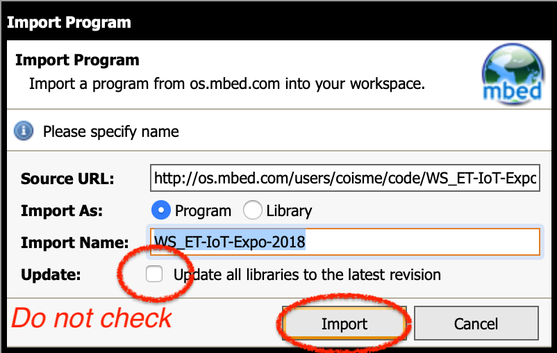
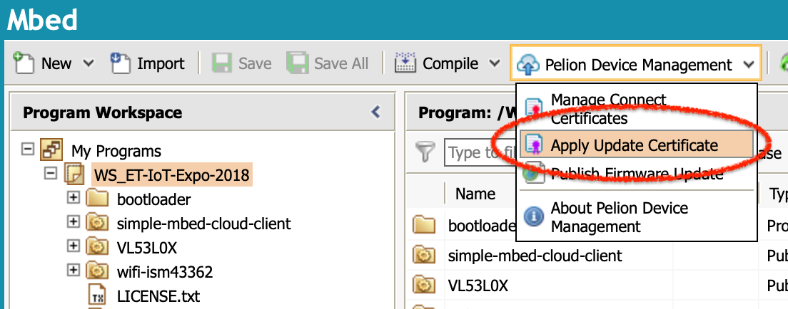

# Pelion Device Management ワークショップ

本ワークショップでは [B-L475E-IOT01A Discovery](https://os.mbed.com/platforms/ST-Discovery-L475E-IOT01A/) ボードを用いて IoT デバイスを作成し、次のことを体験できます。

1. Pelion Device Management で IoT デバイスを管理する
1. IoT デバイスのファームウェアを OTA (Over-The-Air) で更新する
1. Pelion Device Management と連携する WEB アプリを作成する


## 事前準備

### Mbed CLI をインストールする

本ワークショップでは Mbed CLI を使用します。事前にお使いのパソコンで Mbed CLI が使えるようにしておいてください。
インストール方法については[こちら](https://os.mbed.com/docs/latest/tools/installation-and-setup.html)を参照してください。Windows と macOS はインストーラがあります。

### Mbed アカウントを作成する

本ワークショップでは Mbed オンラインコンパイラを使用します。アカウントをお持ちでない方は、事前に以下のサインアップページから登録を済ませておいてください。

https://os.mbed.com/account/signup/


### Pelion Device Management のフリートライアルを登録する

本ワークショップでは Pelion Device Management を使用します。Pelion Device Management のフリートライアルを以下のページから申請してください。申請には上で作成した Mbed アカウントでのログインが必要です。

https://console.mbed.com/cloud-registration

必須項目を入力して *Submit* すると、Pelion Device Management Portal へと画面が遷移します。途中でログイン画面になりますので、*Log in with Mbed.com* ボタンをクリックしてください。


さらに画面が遷移し、Pelion Portal のコンソール画面がでてきますが、ここでライセンス条項への同意が必要になります。


同意する場合は *I accept this license on behalf of my team* にチェックを入れて、*Accept* ボタンをクリックしてください。

完了したら Device Management Portal のウィンドウは閉じて構いません。

## ファームウェアを作成する

Pelion Device Management と連携するために必要な Pelion Device Management Client を含むファームウェアを作成し、IoT デバイスに適用します。


### プラットフォームを追加する

開発ボード（プラットフォーム）として今回使用する B-L475E-IOT01A Discovery kit for IoT node をアカウントに追加します。次のページを開いてください。

https://os.mbed.com/platforms/ST-Discovery-L475E-IOT01A/

画面右にある **Add to your Mbed Compiler** をクリックしてください。


クリックすると追加処理が行われ、完了すると *Platform 'DISCO-L475VG-IOT01A' is now added to your account!* と表示されます。


### プロジェクトをインポートする

オンラインコンパイラのワークスペースにプロジェクトをインポートします。Mbed サイトのログインした状態で、次のページの右にある黄色いボタン *Import into Compiler* をクリックしてください。

https://os.mbed.com/users/coisme/code/WS_ET-IoT-Expo-2018/


*Import into Compiler* ボタンをクリックするとオンラインコンパイラに画面が遷移します。インポートを確認するダイアログがでてくるので、*Import* ボタンをクリックしてインポートします。この際、*Update all libraries to the latest revision* は**チェックしないでください**。




### Wi-Fi アクセスポイントの情報を設定する

IoT デバイスが接続する Wi-Fi  アクセスポイントの情報を設定します。プロジェクトのルートにあるファイル `mbed_app.json` を開き、`target_overrides` の中にある次の項目を編集してください。

```
            "nsapi.default-wifi-security"       : "WPA_WPA2",
            "nsapi.default-wifi-ssid"           : "\"SSID\"",
            "nsapi.default-wifi-password"       : "\"Password\""
```

`nsapi.default-wifi-security` には `WEP`、`WPA`、`WPA2`、`WPA_WPA2` が設定できます。アクセスポイントの設定に応じて適切なものを選択してください。`nsapi.default-wifi-ssid` にはアクセスポイントの SSID を、`nsapi.default-wifi-password` にはパスワードを設定してください。その際、文字列の先頭と最後にエスケープされた引用符 `\"` が必要ですのでご注意ください。


### 開発者用証明書を作成する

IoT デバイス認証のための証明書情報等を含むファイルを生成します。オンラインコンパイラで画面上部にある *Pelion Device Management* メニューを展開し、*Manage Connect Certificates* をクリックします。


証明書を選択するダイアログが出てきますが、初回は利用できる証明書がまだありません。右上にある *Create* ボタンをクリックして証明書を作成します。


証明書を区別するために証明書につける名前を入力して、*OK* ボタンをクリックしてください。


入力した名前で証明書が作成されているので、それを選択して *OK* ボタンをクリックします。


続いて `mbed_cloud_dev_credentials.c` ファイルを上書きしても良いか確認のダイアログが出てきますので、*OK* ボタンをクリックしてください。これで開発者用証明書などが `mbed_cloud_dev_credentials.c` に追加されます。

### アップデート用証明書等を作成する

ファームウェアの OTA アップデート時に、ダウンロードしたファームウェアを検証するための証明書と秘密鍵を生成します。

オンラインコンパイラで画面上部にある *Pelion Device Management* メニューを展開し、*Apply Update Certificate* をクリックします。



確認画面が出てきますので *Create* ボタンをクリックしてください。


`update_default_resources.c` と `update_certificate.pem` を上書きする旨の確認ダイアログが出てきますので、こちらも *Create* ボタンをクリックしてください。ファイルが生成され上書きされます。

続いて、のちほどアップデート用ファームウェアを署名するための秘密鍵をダウンロードするダイアログが出てきますので *Download Private Key* ボタンをクリックして秘密鍵ファイルをダウンロードします。**この秘密鍵は他の人と共有したりせず安全な場所に保管してください**。あとで使用します。


### プロジェクトをビルドする

プロジェクトをビルドする準備ができたので、オンラインコンパイラ上部にある *Compile* ボタンをクリックしてビルドを開始します。


ビルドが完了すると、ファームウェアバイナリファイル `(プロジェクト名).bin` がダウンロードされます。


### IoT デバイスにファームウェアを書き込む

ボードとパソコンを USB ケーブルで接続します。


ボードが `DIS_L4IOT` という名前の USB ドライブとして認識されます。


ドライブの中には `DETAILS.TXT` と `MBED.HTM` というファイルがあるはずです。同じ場所に先ほどダウンロードしたファームウェアをコピーしてください。そうすると、ボード上のマイクロコントローラにファームウェアが書き込まれます。書き込み中はボード上の LD6 という LED が点滅します。


### シリアルモニタを接続する

ターミナル（Windowsではコマンドプロンプト）を起動し、次のコマンドを入力します（最初の `$` は入力の必要はありません）。

```
$ mbed sterm -b 115200
```

IoTデバイスが自動的に認識されて、シリアル通信の内容が表示されます。

### IoT デバイスを起動する

USBケーブルをつないだ状態でボード上の RESET ボタン（黒いボタン）を押すと、IoT デバイスがリセットされファームウェアが起動します。以下は起動時のシリアル通信ログの一例です。環境によって一部の表示が異なります。

```
$ mbed sterm -b 115200
[mbed] Detecting connected targets/boards to your system...
[mbed] Opening serial terminal to "DISCO_L475VG_IOT01A"
--- Terminal on /dev/tty.usbmodem145103 - 115200,8,N,1 ---
[BOOT] Mbed Bootloader
[BOOT] ARM: 00000000000000000000
[BOOT] OEM: 00000000000000000000
[BOOT] Layout: 0 80082A0
[BOOT] Application's start address: 0x8010400
[BOOT] Application's jump address: 0x8011041
[BOOT] Application's stack address: 0x20018000
[BOOT] Forwarding to application...
{LStarting Simple Pelion Device Management Client example
Connecting to the network using Wifi...
Connected to the network successfully. IP address: 192.168.0.17
[SMCC] Autoformatting the storage.
[SMCC] Reset storage to an empty state.
[SMCC] Starting developer flow
Initialized Pelion Client. Registering...
Connected to Pelion Device Management. Endpoint Name: 0166e9235ab80000000000010010012c
```

最後に `Connected to Pelion Device Management. Endpoint Name: XXXXXXXXXXXXXXXXXXXXXX` が表示されれば Pelion Device Management への接続が成功しています。

### Pelion Device Management Portal で確認する

Pelion Device Management Portal 上で、デバイスツリーにデバイスが登録されていることを確認してみましょう。次のページを開いてください。

https://portal.mbedcloud.com/

途中、ログインを求められたときは *Log in with your Mbed.com account* をクリックして、


次に出てくる *Log in with Mbed.com* をクリックしてください。


ログインが完了すると Usage Dashboard が表示されます。画面左のメニューの `Device Directory` をクリックするとデバイス一覧が表示されます。今回は先ほど接続した一台が表示されるはずです。


リストに表示されているデバイス名をクリックするとデバイスの詳細画面が表示されます。デバイス詳細の表示の中にある *RESOURCES* タブをクリックしてください。


IoT デバイスに登録されているリソース一覧が表示されます。この中から `button_count` (`/3200/0/5501`) というリソースを探し、クリックしてください。このリソースは IoT デバイス上の `USER` ボタン（青いボタン）に対応します。


クリックすると、モニタ画面が表示され、リソースの状態をモニタすることができます。`USER` ボタンを押すたびに、`Value` の値が増え、グラフが更新される様子が見られます。


## センサを追加する

[B-L475E-IOT01A Discovery](https://os.mbed.com/platforms/ST-Discovery-L475E-IOT01A/) ボードは様々なセンサを搭載しています。ファームウェアプログラムを変更して、いくつかのセンサの値をモニタできるようにします。そして OTA （Over-The-Air) で IoT デバイスのファームウェアを更新します。

### ENABLE_SENSORSマクロを有効化する


## ファームウエアをOTAでアップデートする

### アップデート用ファームウェアとマニフェストを作成する


### アップデートキャンペーンを準備する


### アップデートキャンペーンを実施する


```
Firmware download requested
Authorization granted
Downloading: [+++|                                              ] 6 %
```

### ファームウェアがアップデートされたことを確認する

```
Firmware download requested
Authorization granted
Downloading: [++++++++++++++++++++++++++++++++++++++++++++++++++] 100 %
Download completed
Firmware install requested
Authorization granted
[BOOT] Mbed Bootloader
[BOOT] ARM: 00000000000000000000
[BOOT] OEM: 00000000000000000000
[BOOT] Layout: 0 80082A0
[BOOT] Active firmware integrity check:
[BOOT] [++++++++++++++++++++++++++++++++++++++++++++++++++++++++++++++++++++++]
[BOOT] SHA256: 0920D91DFB42DC010ED57AAE1402B807BD1BA53DD0D5B6808265932331E12015
[BOOT] Version: 1541509308
[BOOT] Slot 0 firmware integrity check:
[BOOT] [++++++++++++++++++++++++++++++++++++++++++++++++++++++++++++++++++++++]
[BOOT] SHA256: 0B831833F4714A85BAE5006C03248FCC0353487BE6EBE8F59BFB67861494B64C
[BOOT] Version: 1541514141
[BOOT] Update active firmware using slot 0:
[BOOT] [++++++++++++++++++++++++++++++++++++++++++++++++++++++++++++++++++++++]
[BOOT] Verify new active firmware:
[BOOT] [++++++++++++++++++++++++++++++++++++++++++++++++++++++++++++++++++++++]
[BOOT] New active firmware is valid
[BOOT] Application's start address: 0x8010400
[BOOT] Application's jump address: 0x8011041
[BOOT] Application's stack address: 0x20018000
[BOOT] Forwarding to application...
{LStarting Simple Pelion Device Management Client example
Invalid new address!
Connecting to the network using Wifi...
Connected to the network successfully. IP address: 192.168.0.17
[SMCC] Starting developer flow
[SMCC] Developer credentials already exist
Initialized Pelion Client. Registering...
Connected to Pelion Device Management. Endpoint Name: 0166e9235ab80000000000010010012c
VL53L0X [mm]:               304
```


## WEBアプリケーションを作る

### SDK

### ...
