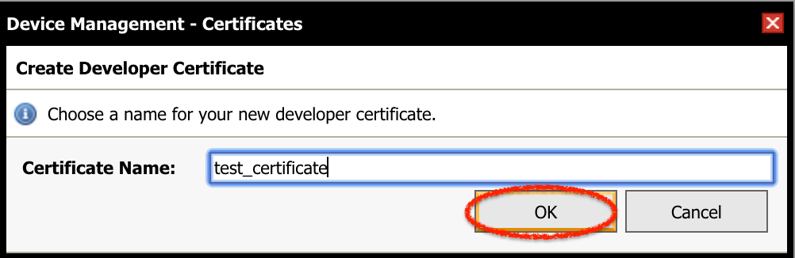
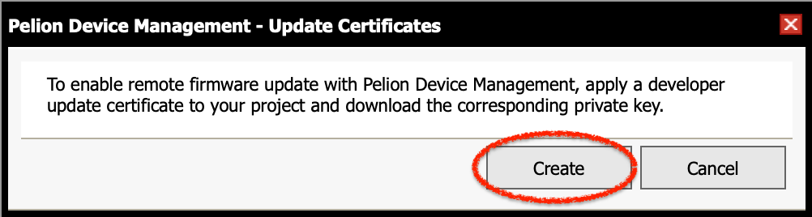

In this workshop, you can experience the following things with [B-L475E-IOT01A Discovery](https://os.mbed.com/platforms/ST-Discovery-L475E-IOT01A/) board.

1. Build IoT device firmware using Mbed Online Compiler
1. Manage the IoT device on Pelion Device Management
1. Update the IoT deivce's firmware by OTA (over-the-air)

# Prepare

## Install Terminal Software

In this workshop, we use terminal software for monitoring messages from the IoT device. Please install [Teraterm](https://ja.osdn.net/projects/ttssh2/) (Windows), [Coolterm](http://freeware.the-meiers.org) (Windows/macOS/Linux), or other terminal software.

## Create Mbed Account

In this workshop, we use Mbed online compiler. Please create an account before the workshop if you don't have one.

https://os.mbed.com/account/signup/

## Request Free Trial of Pelion Device Management

In this workshop, we use Pelion Device Management. Please request free trial of Pelion Device Management from the following page. You need an Mbed account created above to apply your request.

https://console.mbed.com/cloud-registration

Input the required fields, then click the *Submit* button. You will be jumped to Pelion Device Management Portal. In the middle of the process, log in page appears. Click the *Log in with Mbed.com* button.

||
|:-:|

Forwarded to the license agreement page, read it carefully and accept the license agreement.

||
|:-:|

Once you finished the above process, you can close the Device Management Portal page.

# Create Firmware

Let's create a firmware image contains Pelion Device Management Client, which connects to Pelion Device Management. Then apply the firmware image to the B-L475E-IOT01A Discovery board and create an IoT device.

## Add Platform

Adds B-L475E-IOT01A Discovery kit for IoT node to your Mbed account. Please add by either way below.

### Add via Your Board

Log in Mbed.com and follow this:

1. Connect your PC and your board with USB cable. The board is recognized as a USB storage.
1. Open the `MBED.HTM` file with browser.

### Add via Mbed site

Open this page:

https://os.mbed.com/platforms/ST-Discovery-L475E-IOT01A/

Click the ** Add to your Mbed Compiler** button at the right side.

||
|:-:|

When you click, the platform is added to your account and you'll see the message "*Platform 'DISCO-L475VG-IOT01A' is now added to your account!*".

## Import Project

Let's import the firmware project into your workspace in online compiler. Go to the page below. You need to log in Mbed web site. Click the yellow button *Import into Compiler*.

https://os.mbed.com/users/coisme/code/Pelion-DM-Workshop-Project/


Click the *Import into Compiler* button, you'll be moved to the online compiler. Then the confirmation dialog will appear. Click the *Import* button to import. Do NOT check *Update all libraries to the latest revision* check box.


## Set Up Wi-Fi Access Point

Sets the Wi-Fi access point which IoT device connect to. Open the `mbed_app.json` file in the project root, then edit the items below in the `target_overrides` section.

```
            "nsapi.default-wifi-security"       : "WPA_WPA2",
            "nsapi.default-wifi-ssid"           : "\"SSID\"",
            "nsapi.default-wifi-password"       : "\"Password\""
```

`WEP`, `WPA`, `WPA2`, or `WPA_WPA2` can be set for `nsapi.default-wifi-security`. Set an appropriate one correspond to your access point. Set SSID of your access point to `nsapi.default-wifi-ssid`, and set your password to `nsapi.default-wifi-password`. Note that you need to add the escaped quotation mark `\"` at the head and tail of the string in quotation marks.


## Create Developer Certificates

Let's create a file which contains certificates and other information, these are needed to connect to Pelion Device Management. Open the *Pelion Device Management* menu at the top of online compiler window and click the *Manage Connect Certificates*.


You'll see the dialog to select a certificate. You won't see any certificate at the first time. Click the *Create* button to create a new certificate.


Input name and click the *OK* button.



The certificate is created with the name you input. Select it and click the *OK* button.


Then you'll see the dialog box to confirm overwrite `mbed_cloud_dev_credentials.c`, click the *OK* button. In this step, developer certificates and other parameters are added into `mbed_cloud_dev_credentials.c`.


## Create Certificate for Firmware Update

Create key pairs and certificates to verify download firmware when update is performed via network. 

Open the *Pelion Device Management* menu at the top of online compiler window and click the *Apply Update Certificate*. 


Confirmation dialog appears, click the *Create* button.



You'll see the dialog to confirm `update_default_resources.c` and `update_certificate.pem` will be overwritten. Click the *Create* button. These files will be created and overwritten if exist.

Then you'll see the dialog to download private key to sign update firmware, click the *Download Private Key* button and download the private key file. **Do not share this key file with other people. Store it at secure place.**. This key is used later.

