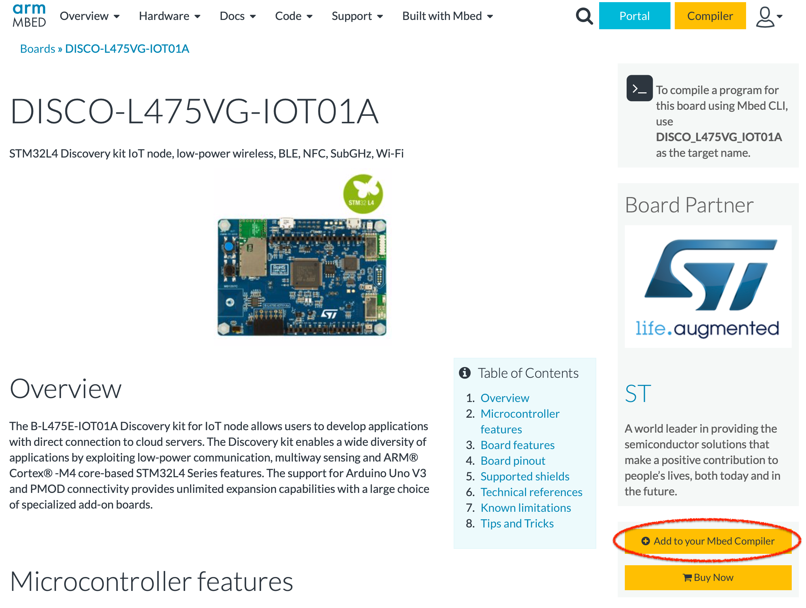
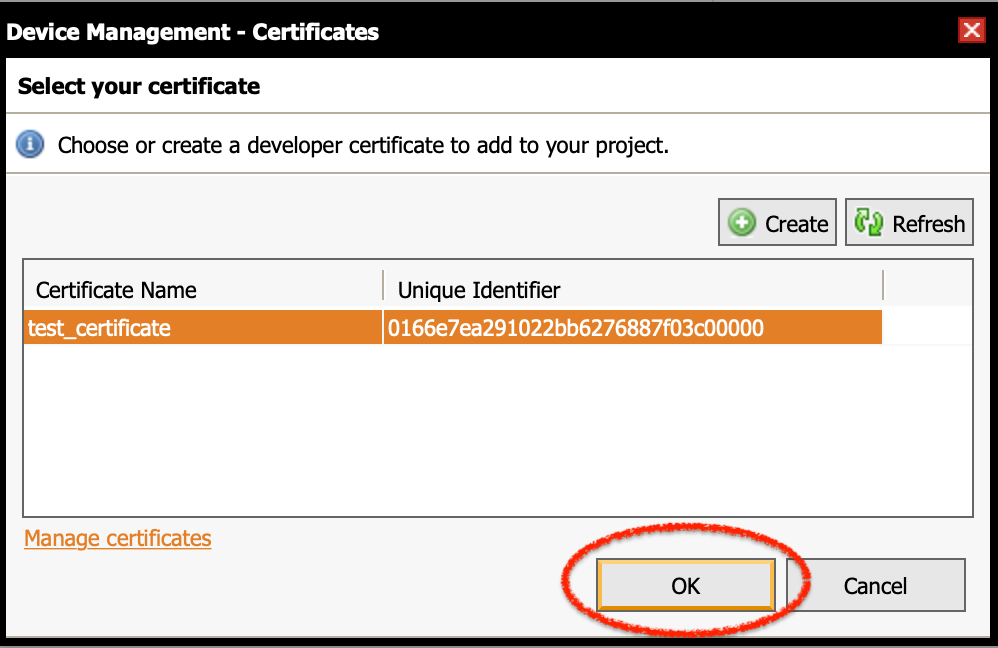
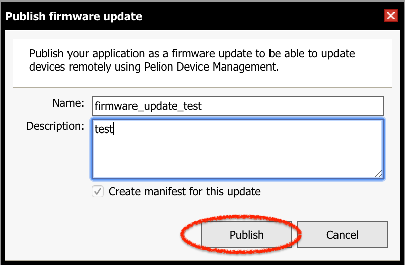
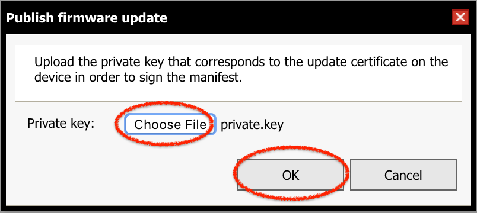
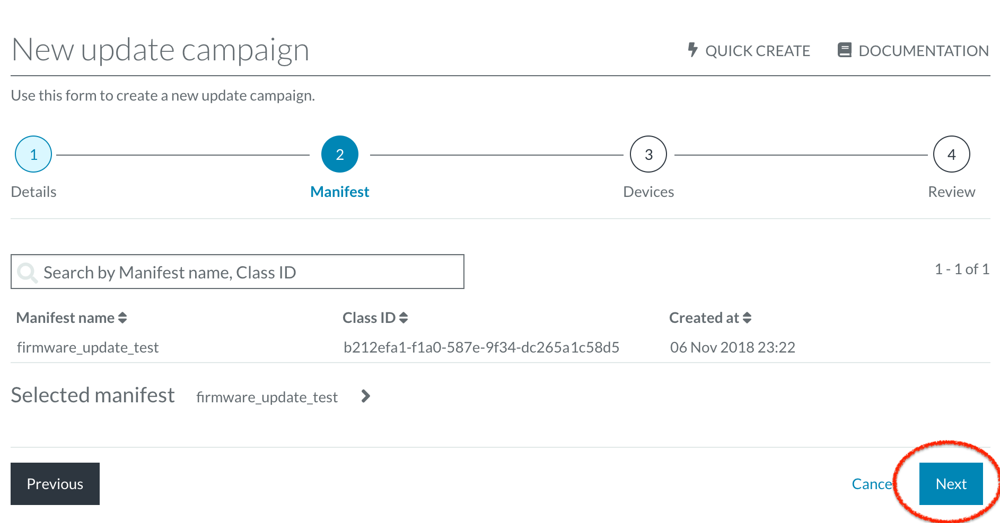
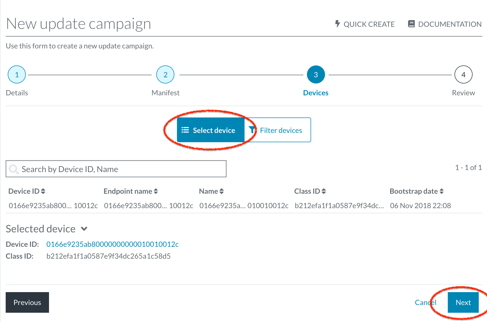
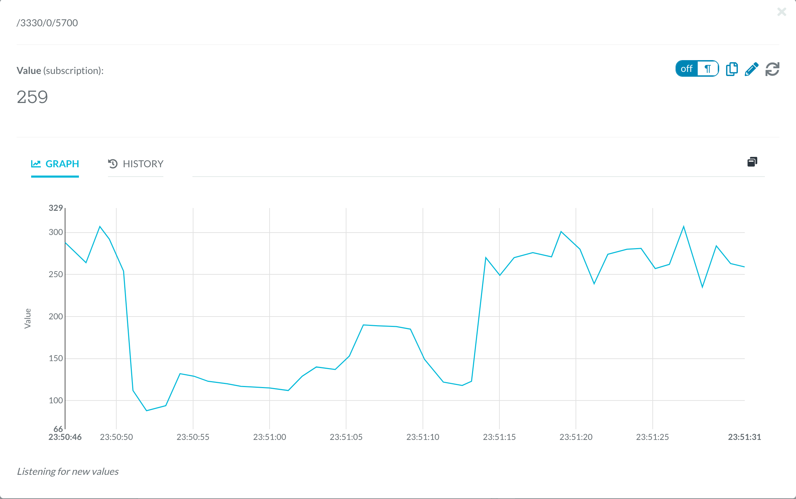
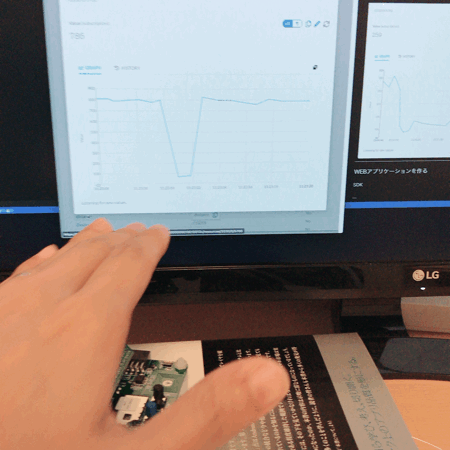

In this workshop, you can experience the following things with [B-L475E-IOT01A Discovery](https://os.mbed.com/platforms/ST-Discovery-L475E-IOT01A/) board.

1. Build IoT device firmware using Mbed Online Compiler
1. Manage the IoT device on Pelion Device Management
1. Update the IoT deivce's firmware by OTA (over-the-air)

# Prepare

## Browser

Please use **Chrome** or **Firefox**. **Edge** and **Internet Explorer** may cause problen in this workshop process.

## Install Terminal Software

In this workshop, we use terminal software for monitoring messages from the IoT device. Please install [Teraterm](https://ja.osdn.net/projects/ttssh2/) (Windows), [Coolterm](http://freeware.the-meiers.org) (Windows/macOS/Linux), or other terminal software.

On Windows, you might need to install this device driver. Please download and install:
https://www.st.com/content/st_com/en/products/development-tools/software-development-tools/stm32-software-development-tools/stm32-utilities/stsw-link009.html


## Create Mbed Account

In this workshop, we use Mbed online compiler. Please create an account before the workshop if you don't have one.

https://os.mbed.com/account/signup/

Please make sure that E-mail verification is done, otherwise you'll fail to get Free Trial in the next step.

## Request Free Trial of Pelion Device Management

In this workshop, we use Pelion Device Management. Please request free trial of Pelion Device Management from the following page. You need an Mbed account created above to apply your request.

https://console.mbed.com/cloud-registration

Input the required fields, then click the *Submit* button. You will be jumped to Pelion Device Management Portal. In the middle of the process, log in page appears. Click the *Log in with Mbed.com* button.

||
|:-:|

Forwarded to the license agreement page, read it carefully and accept the license agreement.

||
|:-:|

Once you finished the above process, you can close the Device Management Portal page.

# Create Firmware

Let's create a firmware image contains Pelion Device Management Client, which connects to Pelion Device Management. Then apply the firmware image to the B-L475E-IOT01A Discovery board and create an IoT device.

## Add Platform

Adds B-L475E-IOT01A Discovery kit for IoT node to your Mbed account. Please add by either way below.

### Add via Your Board

Log in Mbed.com and follow this:

1. Connect your PC and your board with USB cable. The board is recognized as a USB storage.
1. Open the `MBED.HTM` file with browser.

### Add via Mbed site

Open this page:

https://os.mbed.com/platforms/ST-Discovery-L475E-IOT01A/

Click the ** Add to your Mbed Compiler** button at the right side.

||
|:-:|

When you click, the platform is added to your account and you'll see the message "*Platform 'DISCO-L475VG-IOT01A' is now added to your account!*".

## Import Project

Let's import the firmware project into your workspace in online compiler. Go to the page below. You need to log in Mbed web site. Click the yellow button *Import into Compiler*.

https://os.mbed.com/users/coisme/code/Pelion-DM-Workshop-Project/


Click the *Import into Compiler* button, you'll be moved to the online compiler. Then the confirmation dialog will appear. Click the *Import* button to import. Do NOT check *Update all libraries to the latest revision* check box.


## Set Up Wi-Fi Access Point

Sets the Wi-Fi access point which IoT device connect to. Open the `mbed_app.json` file in the project root, then edit the items below in the `target_overrides` section.

```
            "nsapi.default-wifi-security"       : "WPA_WPA2",
            "nsapi.default-wifi-ssid"           : "\"SSID\"",
            "nsapi.default-wifi-password"       : "\"Password\""
```

`WEP`, `WPA`, `WPA2`, or `WPA_WPA2` can be set for `nsapi.default-wifi-security`. Set an appropriate one correspond to your access point. Set SSID of your access point to `nsapi.default-wifi-ssid`, and set your password to `nsapi.default-wifi-password`. Note that you need to add the escaped quotation mark `\"` at the head and tail of the string in quotation marks.


## Create Developer Certificates

Let's create a file which contains certificates and other information, these are needed to connect to Pelion Device Management. Open the *Pelion Device Management* menu at the top of online compiler window and click the *Manage Connect Certificates*.


You'll see the dialog to select a certificate. You won't see any certificate at the first time. Click the *Create* button to create a new certificate.


Input name and click the *OK* button.


The certificate is created with the name you input. Select it and click the *OK* button.



Then you'll see the dialog box to confirm overwrite `mbed_cloud_dev_credentials.c`, click the *OK* button. In this step, developer certificates and other parameters are added into `mbed_cloud_dev_credentials.c`.


## Create Certificate for Firmware Update

Create key pairs and certificates to verify download firmware when update is performed via network. 

Open the *Pelion Device Management* menu at the top of online compiler window and click the *Apply Update Certificate*. 


Confirmation dialog appears, click the *Create* button.


You'll see the dialog to confirm `update_default_resources.c` and `update_certificate.pem` will be overwritten. Click the *Create* button. These files will be created and overwritten if exist.

Then you'll see the dialog to download private key to sign update firmware, click the *Download Private Key* button and download the private key file. **Do not share this key file with other people. Store it at secure place.**. This key is used later.


## Build Project

Now we're ready to build the project. Click the *Compile* button at the top of online compiler window.


Once compile is finished, the firmware binary file `(project name).bin` will be downloaded.


## Connect Board to PC

Connects the board to your PC via USB cable. The board has two USB connectors, `USB OTG` and `USB STLINK`. Connect to `USB STLINK`.


## Connect Serial Monitor

Launch the terminal software and connect to the board. Here're parameters for serial connection:

|parameter|value|
--|--
|baud|115200|
|data bit|8-bit|
|parity|none|
|stop bit|1|
|flow control|none|


## Write Firmware Image

Connecting your board to your PC, the board is recognized as a USB mass storage drive named `DIS_L4IOT`.


In the drive, you'll see the files `DETAILS.TXT` and `MBED.HTM`. Copy the downloaded firmware image file into the same directory. Then the firmware image is written into the micro controller on your board. While writing, an LED on your board blinks.


## Run IoT Device

Right after the firmware image is written, the IoT device resets and the firmware runs automatically. The following is an example of serial output from the IoT device. The messages might be different on your environment.

```
[BOOT] Mbed Bootloader
[BOOT] ARM: 00000000000000000000
[BOOT] OEM: 00000000000000000000
[BOOT] Layout: 0 80082A0
[BOOT] Application's start address: 0x8010400
[BOOT] Application's jump address: 0x8011041
[BOOT] Application's stack address: 0x20018000
[BOOT] Forwarding to application...
{LStarting Simple Pelion Device Management Client example
Connecting to the network using Wifi...
Connected to the network successfully. IP address: 192.168.0.17
[SMCC] Autoformatting the storage.
[SMCC] Reset storage to an empty state.
[SMCC] Starting developer flow
Initialized Pelion Client. Registering...
Connected to Pelion Device Management. Endpoint Name: 0166e9235ab80000000000010010012c
```

At the end, the message like `Connected to Pelion Device Management. Endpoint Name: XXXXXXXXXXXXXXXXXXXXXX` should appear. If you can see this message, the IoT device has been connected to Pelion Device Management. Where, `XXXXXXXXXXXXXXXXXXXXXX` (`0166e9235ab80000000000010010012c` in the exapmle above) is the endpoint name (device ID), which is used later. 

If you don't see any message on your terminal, push the `RESET` button, the black push button, on your board.


## Confirm on Pelion Device Management

Let's confirm the IoT device is registered to Pelion Device Management on the portal site. Open this page:

https://portal.mbedcloud.com/

If log in is requested, click the *Log in with your Mbed.com account*,

||
|:-:|

then, click the *Log in with Mbed.com* button.

||
|:-:|

Once logged in, Usage Dashboard appears. Click the `Devices` in `Device Directory` in the left menu, then you'll see device list. You should see the one you registered in the previous steps.


Click the device name, device details view is shown. Choose the *RESOURCES* tab in the device details view.


The resources registered in the device are shown. Find the `button_count` ( `/3200/0/5501` ) resource. This resource is correspond to the `UESR` button, the blue push button, on your board.


Click the resource name. You'll see the resource value, i.e. button count. When you push the `USER` button, the IoT device count up the internal counter and send its value to Pelion Device Management. You'll see the updated value on the portal. Every your push, you should see the value is updated.


# Add Sensors

[B-L475E-IOT01A Discovery](https://os.mbed.com/platforms/ST-Discovery-L475E-IOT01A/) board has various sensors. Let's enable some of them and monitor the values on the Pelion Device Management portal. To do that, we add sensor code to the firmware. Then update the firmware on the IoT device by OTA (Over-The-Air).

## Enable ENABLE_SENSORS Macro

In this workshop, to save time for coding, sensor code is prepared and can be enabled by compile-time switch. To enable the sensor code, define `ENABLE_SENSORS`.

Find the line `//#define ENABLE_SENSORS` at the top part of `main.cpp`. The `ENABLE_SENSORS` macro is comment out by default, sensors are not enabled. To enable sensors, remove the `//` at the head of the line.


Then the sensor codes between `#ifdef ENABLE_SENSORS` and `#endif /* ENABLE_SENSORS */` are enabled.


# Update Firmware by OTA

Update firmware on the IoT device by OTA (Over-The-Air) with the firmware modified in the previous step.

In the workshop, the IoT device is at your hand. You might feel no difference between via USB and via OTA. However, IoT devices will be deployed massive and wide area. It's not realistic to update one by one via USB by hand. OTA update is necessary for IoT.

Here, we use the online compiler to perform OTA update. You can do the same thing with Mbed CLI. If you'd like to use Mbed CLI, please refer [](). 


## Create Update Firmware and Manifest

To perform OTA firmware update, an update firmware image and manifest are needed. To create them, click the *Publish Firmware Update* in *Pelion Device Management* at the top of online compiler window.


Input name and description of this update. Description can be empty. Once you finished, click the *Publish* button.



Next, specify the private key file to sign the update firmware. Click the *Choose File* and specify the private key file `private.key`, which you download at the previous step. After specify it, click the *OK* button.



Manifest will be created and signed, and the manifest and firmware will be upload to the server.


Once this step is finished, click the *Open Device Management Portal* and open Pelion Device Management Portal.


## Prepare Update Campaign

The update firmware image and manifest were upload. Set up the firmware update next. After open the Pelion Device Management portal, you'll see wizard to create a *campaign* draft for firmware update. 

In step 1, input name and description of this campaign. The name field is filled automatically. You can go with the default value. Description field can be empty. After input, click the *Next* button.

||
|:-:|

In step 2, you select manifest. The uploaded manifest should be selected automatically. You just click the *Next* button.

||
|:-:|

In step 3, you choose the device(s) to apply the firmware update. Click the *Select device* to see IoT devices list. Choose the IoT device which has the same device ID in the previous step. 

||
|:-:|

In the last step, confirm the campaign details. After check, click the *Finish* button. Then a campaign draft will be created.

||
|:-:|


## Perform Update Campaign

The campaign you created will be shown. Click the *Start* button to start the campaign.

||
|:-:|

Once the campaign started, the status will be *Active*.

||
|:-:|

The serial monitor of the IoT device shows progress of new firmware download.

```
Firmware download requested
Authorization granted
Downloading: [+++|                                              ] 6 %
```

Once firmware is downloaded successfully, the status on the portal will change to *Stopped: Threshold 100.00% reached.*.

||
|:-:|

The IoT device verifies the downloaded firmware, then reboot automatically.


## Check Updated

When the IoT device reboots, new downloaded firmware image will runs. Sensor values are periodically shown on the serial monitor.

```
Firmware download requested
Authorization granted
Downloading: [++++++++++++++++++++++++++++++++++++++++++++++++++] 100 %
Download completed
Firmware install requested
Authorization granted
[BOOT] Mbed Bootloader
[BOOT] ARM: 00000000000000000000
[BOOT] OEM: 00000000000000000000
[BOOT] Layout: 0 80082A0
[BOOT] Active firmware integrity check:
[BOOT] [++++++++++++++++++++++++++++++++++++++++++++++++++++++++++++++++++++++]
[BOOT] SHA256: 0920D91DFB42DC010ED57AAE1402B807BD1BA53DD0D5B6808265932331E12015
[BOOT] Version: 1541509308
[BOOT] Slot 0 firmware integrity check:
[BOOT] [++++++++++++++++++++++++++++++++++++++++++++++++++++++++++++++++++++++]
[BOOT] SHA256: 0B831833F4714A85BAE5006C03248FCC0353487BE6EBE8F59BFB67861494B64C
[BOOT] Version: 1541514141
[BOOT] Update active firmware using slot 0:
[BOOT] [++++++++++++++++++++++++++++++++++++++++++++++++++++++++++++++++++++++]
[BOOT] Verify new active firmware:
[BOOT] [++++++++++++++++++++++++++++++++++++++++++++++++++++++++++++++++++++++]
[BOOT] New active firmware is valid
[BOOT] Application's start address: 0x8010400
[BOOT] Application's jump address: 0x8011041
[BOOT] Application's stack address: 0x20018000
[BOOT] Forwarding to application...
{LStarting Simple Pelion Device Management Client example
Invalid new address!
Connecting to the network using Wifi...
Connected to the network successfully. IP address: 192.168.0.17
[SMCC] Starting developer flow
[SMCC] Developer credentials already exist
Initialized Pelion Client. Registering...
Connected to Pelion Device Management. Endpoint Name: 0166e9235ab80000000000010010012c
VL53L0X [mm]:               304
```

Sensor resources are added on the device resource list in Pelion Device Management Portal. For example, `distance` resource. Clicking it, the value of the distance sensor on the IoT device is shown.

||
|:-:|




# Appendix A. Update Firmware with Mbed CLI

Here shows OTA update steps with Mbed CLI, not online compiler. Supposed that the latest Mbed CLI is already installed into your PC. About Mbed CLI, please refer to [GitHub repository of Mbed CLI](https://github.com/ARMmbed/mbed-cli).


## Import Project

Execute the following command from your command line. The `$` at the head of lines are marker, and you don't have to input.

```
$ mbed import https://github.com/coisme/Pelion-DM-Workshop-Project
```

The target project will be imported with the directory name `Pelion-DM-Workshop-Project`. Move to this project root.

```
$ cd Pelion-DM-Workshop-Project
```


## Obtain API key

To interact with Pelion Device Management from Mbed CLI, you need an API key. Refer to [Generating an API key](https://cloud.mbed.com/docs/current/integrate-web-app/api-keys.html#generating-an-api-key) page.


## Set Up Project

Set up your API key and build toolchain. 

```
$ mbed config -G CLOUD_SDK_API_KEY <API_KEY>
$ mbed target DISCO_L475VG_IOT01A
$ mbed toolchain GCC_ARM
```

Next, generate necessary files to connect your IoT device to Pelion Device Management.

```
$ mbed dm init -d "example.com" --model-name "PELION_DEMO" -q --force
```

## Set Up Wi-Fi Access Point 

Please refer to the section [Set Up Wi-Fi Access Point](#Set-Up-Wi-Fi-Access-Point).


## Build Project

Create IoT device's firmware by building the project. Execute the following command and build the project. It may take a few minutes.

```
$ mbed compile
```

Once built successfully, you'll see the message like this:

```
| Module                                                |          .text |      .data |        .bss |
|-------------------------------------------------------|----------------|------------|-------------|
| VL53L0X/VL53L0X.o                                     |     26(-12402) |    0(-697) |       0(+0) |
| [fill]                                                |        766(+2) |     13(+1) |     108(+4) |
| [lib]/c.a                                             |      56430(+0) |   2548(+0) |     127(+0) |
| [lib]/gcc.a                                           |       7460(+0) |      0(+0) |       0(+0) |
| [lib]/misc                                            |        252(+0) |     16(+0) |      28(+0) |
| [lib]/nosys.a                                         |         32(+0) |      0(+0) |       0(+0) |
| [lib]/stdc++.a                                        |       8478(+0) |     44(+0) |     204(+0) |
| main.o                                                |     2313(-830) |      4(+0) |   232(-724) |
| mbed-os/components                                    |      5694(+70) |      0(+0) |       0(+0) |
| mbed-os/drivers                                       |     3594(-452) |      4(+0) |    184(-44) |
| mbed-os/events                                        |       1855(+0) |      0(+0) |    3144(+0) |
| mbed-os/features                                      |    120419(+22) |    191(+0) |    7842(+0) |
| mbed-os/hal                                           |       2061(+0) |      4(+0) |      68(+0) |
| mbed-os/platform                                      |       5351(+0) |    272(+0) |     646(+0) |
| mbed-os/rtos                                          |      13512(+0) |    168(+0) |    6969(+0) |
| mbed-os/targets                                       |   19806(-5065) |      8(+0) |   1457(-20) |
| mbed_cloud_dev_credentials.o                          |       1525(+0) |      0(+0) |       0(+0) |
| simple-mbed-cloud-client/mbed-cloud-client            |     123464(+0) |    416(+0) |    5865(+0) |
| simple-mbed-cloud-client/mbed_cloud_client_resource.o |       1298(+0) |      0(+0) |       0(+0) |
| simple-mbed-cloud-client/resource.o                   |        699(+0) |      0(+0) |       0(+0) |
| simple-mbed-cloud-client/simple-mbed-cloud-client.o   |       3364(+0) |      0(+0) |       8(+0) |
| simple-mbed-cloud-client/update_ui_example.o          |        456(+0) |      0(+0) |       6(+0) |
| update_default_resources.o                            |        460(+0) |      0(+0) |       0(+0) |
| wifi-ism43362/ISM43362                                |       7734(+0) |      0(+0) |       0(+0) |
| wifi-ism43362/ISM43362Interface.o                     |       4189(+0) |      0(+0) |     964(+0) |
| Subtotals                                             | 391238(-18655) | 3688(-696) | 27852(-784) |
Total Static RAM memory (data + bss): 31540(-1480) bytes
Total Flash memory (text + data): 394926(-19351) bytes

Update Image: ./BUILD/DISCO_L475VG_IOT01A/GCC_ARM/Pelion-DM-Workshop-Project_update.bin
Image: ./BUILD/DISCO_L475VG_IOT01A/GCC_ARM/Pelion-DM-Workshop-Project.bin
```

The last two lines are the relative path of generated firmware images. The first one is for firmware update. The second one, contains boot loader, is for initial setup.


## Write Firmware ~ Confirm on Pelion Device Management

The same steps as online compiler. Refer to the links below. Use `./BUILD/DISCO_L475VG_IOT01A/GCC_ARM/WS_ET-IoT-Expo-2018.bin` as the downloaded firmware image.

1. [Connect Board to PC](#Connect-Board-to-PC)
1. [Connect Serial Monitor](#Connect-Serial-Monitor)
1. [Write Firmware Image](#Write-Firmware-Image)
1. [Run IoT Device](#Run-IoT-Device)
1. [Confirm on Pelion Device Management](#Confirm-on-Pelion-Device-Management)

## Add Sensors

The same steps as online compiler. Refer to the link below.

[Add Sensors](#Add-Sensors)

## Create Update Firmware Image

Rebuild the project and create firmware image for update. Execute the following command:

```
$ mbed compile
```

## Perform Firmware Update by OTA

Let's perform OTA firmware update. Here, you need replace `<device ID>` with the device ID of your connected device.

```
$ mbed dm update device -D <device ID> -m DISCO_L475VG_IOT01A
```

Progress of firmware download appears on your serial monitor.

```
Firmware download requested
Authorization granted
Downloading: [+++|                                              ] 6 %
```

Once download done and verify the download stuff, the IoT device reboots automatically.

## Check Updated

To check if the IoT device is update successfully, please refer the section [Check Updated](#Check-Updated)

